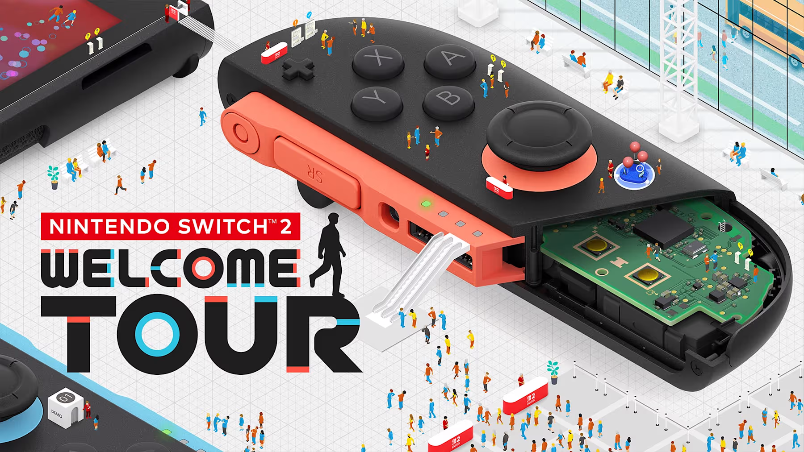

# Switch2WelcomeTour_manual_apworld
Manual apworld for Nintendo Switch 2 Welcome Tour, made with [Manual for Archipelago.](https://github.com/ManualForArchipelago/Manual)

# [<u>**>>Click here to download latest release<<**</u>](https://github.com/Iristallite/Switch2WelcomeTour_manual_apworld/releases/latest)
## How do I use this?
I will refer you to the offical [Archipelago setup guide](https://archipelago.gg/tutorial/Archipelago/setup_en) for how to set up Archipelago.

Use the `Install APWorld` option in the Archipelago launcher to install the `.apworld` files from the [Releases tab](https://github.com/Iristallite/deBlob_manual_apworlds/releases/latest)  
I have also provided some template `.yaml` files with the release.  
You can also just grab the `.apworld` and `.yaml` files from the folders, but I'd recommend sticking to the Releases for simplicity's sake.

## ...you actually made a manual for *Switch 2 Welcome Tour???*
...yes? I came up with the idea to do this while taking a bath; it's only *slightly* a shitpost, but I hope you enjoy nonetheless!

  </img> 
  <b>Nintendo Switch 2 Welcome Tour</b> copyright 2025 Nintendo 

Image sourced from the game's eShop page.

## Where can I get the game?
* Switch 2 eShop: [14.99 CAD](https://nintendo.com/en-ca/store/products/nintendo-switch-2-welcome-tour-switch-2/) / [9.99 USD](https://nintendo.com/us/store/products/nintendo-switch-2-welcome-tour-switch-2/) / [7.99 GBP](https://nintendo.com/en-gb/Games/Nintendo-Switch-2-games/Nintendo-Switch-2-Welcome-Tour-2789271.html) / [15.00 AUD](https://ec.nintendo.com/AU/en/titles/70010000096814) / 9.99 EUR  
I'm not listing every currency but these are *probably* the most notable ones for english speakers

## How does this manual apworld work, exactly?
...It doesn't! At least in terms of connecting to the game.well, duh, it's a *manual* apworld  
More seriously, it should be pretty easy to figure out... ALTHOUGH
I ***HEAVILY*** recommend the use of [Universal Tracker](https://github.com/FarisTheAncient/Archipelago/releases?q=Tracker) for this one.  
It'll highlight what you can do, which helps massively in this game... wow that was kinda redundant, but I'm leaving it in.

DeathLink is an option if you're into that.
### DeathLink explanation
Send one for every X failed attempts at a minigame (default 8) or quiz (default 1)  
If you receive one from someone else, uh... close and restart the game?  
There's a decent chance you're not actively playing a minigame or quiz while you receive one so I did this instead to annoy you as much as possible
## YAML options
* `minigames_medal_1`, `minigames_medal_2`, `minigames_medal_3`  
Select which minigame medals to include; the third ones are **NOT IMPLEMENTED YET SORRY** ~~hidden until you either get the prior 2 and restart the minigame, or meet the criteria for the third medals on your first attempt.~~
* `accessory_4k_display`, `accessory_camera`, `accessory_gl_gr`  
Certain minigames in Welcome Tour require accessories that don't come with the console.  
Namely, a 4K display, a (compatible) USB camera, and GL/GR buttons, which are found on the Joy-Con 2 Charging Grip and Switch 2 Pro Controller.  
These options are **disabled by default**, to match what a stock Switch 2 comes with as of December 2025.
* `death_link`: standard issue deathlink setting, explained above
* `minigame_attempts`, `quiz_attempts` (deathlink)  
Technically not defined, but they're here so you can remember how many attempts you gave yourself for minigames and quizzes.

## Checks
There are checks for Lost Items, Tech Demos, Minigames, Quizzes, Insights, and Stamps.  
I am absolutely *not* going to list all 500-something of them...  
But I will say this: You get the lost Item check by *returning* the lost items to the Information Center, *not* when you pick them up.

## Items
* `Stamp`: Gates area progression.  
The amounts needed to progress through the areas are kind of arbitrary, so I really hope you have [Universal Tracker](https://github.com/FarisTheAncient/Archipelago/releases?q=Tracker) installed.
* `Quiz Book`: Unlocks the corresponding quiz.  
You are, however, allowed to activate all quizzes (make the insights appear and add them as fast travel points), without the Quiz Books, but you need the Quiz Books to read their insights.
* `Medal`: Used to unlock minigames and tech demos.
* `Insight`: The filler item.
* `Lost Item`: Also filler.  
I had *considered* using these instead of Stamps to gate area progression, but I decided to stick closer to how the actual game works, which means they do [**NOTHING! YOU *LOSE!!* GOOD DAY SIR!!!**](https://youtu.be/M5QGkOGZubQ)

## Vital info
Typing out an **SOS in morse code** (...---...) with the Y button while standing next to an unlocked minigame or tech demo will give you some silver Skip Medals.  
This can be used to increase your save's medal count to match the AP tracker.  
**Please only send the minigame checks if you have the gold Clear Medals!**  
**The silver Skip Medals are ineligible for the checks unless you physically cannot complete the minigame.**  
**If you have the accessory-required minigames disabled in your YAML, please skip them ingame.**