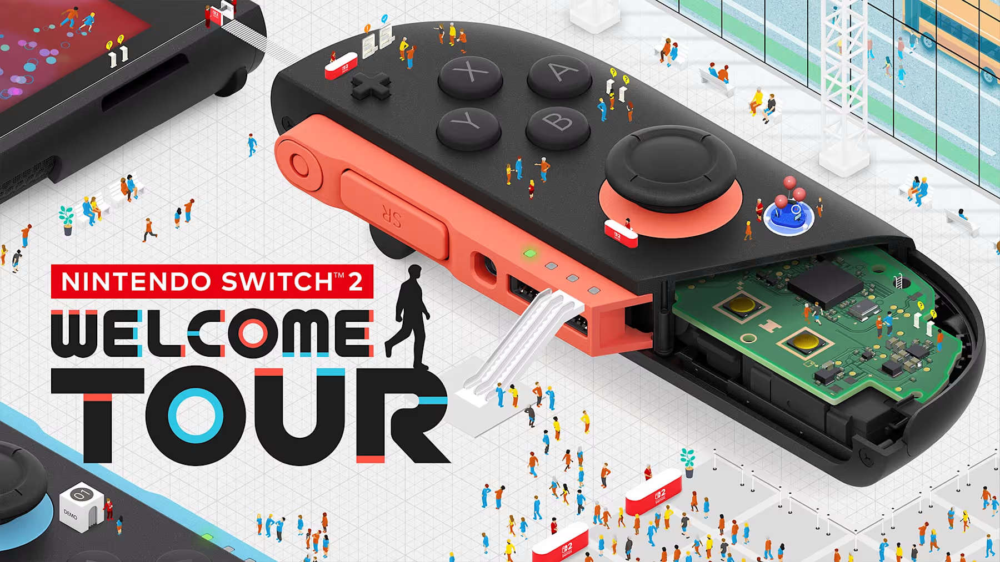

# Switch2WelcomeTour_manual_apworld
Manual apworld for Nintendo Switch 2 Welcome Tour, made with [Manual for Archipelago.](https://github.com/ManualForArchipelago/Manual)

Quick links: [Latest Release](https://github.com/Iristallite/Switch2WelcomeTour_manual_apworld/releases/latest), [Full Changelog](CHANGELOG.md), [Manual AP Discord Thread](https://discord.com/channels/1097532591650910289/1459348754929942664)

## Table of contents:
- [...you actually made a manual for *Switch 2 Welcome Tour???*](#you-actually-made-a-manual-for-switch-2-welcome-tour)
- [Where can I get the game?](#where-can-i-get-the-game)
- [How does it work?](#how-does-it-work)
- [Installation](#installation)
- [Tracking your logic](#tracking-your-logic)
- [YAML options](#yaml-options)
- [DeathLink](#deathlink)
- [Checks](#checks)
- [Items](#items)
- [Q\&A](#qa)
  - [Why did you make this?](#why-did-you-make-this)
  - [How much custom code did you add?](#how-much-custom-code-did-you-add)
  - [I see checks in logic on the `Manual` tab, but can't find them in the `Map Tracker`?](#i-see-checks-in-logic-on-the-manual-tab-but-cant-find-them-in-the-map-tracker)
  - [I don't like the `Map Tracker` page!](#i-dont-like-the-map-tracker-page)
  - [If using standalone VT is better, why do you even have the integrated tab?](#if-using-standalone-vt-is-better-why-do-you-even-have-the-integrated-tab)
  - [Wait, Visual Tracker? Why not PopTracker?](#wait-visual-tracker-why-not-poptracker)
  - [I'm annoyed at having to constantly undock my Switch 2!](#im-annoyed-at-having-to-constantly-undock-my-switch-2)
  - [Some checks are missing, you messed it up!!!](#some-checks-are-missing-you-messed-it-up)
  - [Minigame is too hard  ):](#minigame-is-too-hard--)
- [Everything used to make this apworld](#everything-used-to-make-this-apworld)
- [Special thanks](#special-thanks)

## ...you actually made a manual for *Switch 2 Welcome Tour???*
...yes? I came up with the idea to do this while taking a bath; it's only *slightly* a shitpost, but I hope you enjoy nonetheless!  
(I'm a lot more apologetic for this game than most people are)

  </img> 
  <b>Nintendo Switch 2 Welcome Tour</b> copyright 2025 Nintendo 
  Image sourced from the game's eShop page. 

## Where can I get the game?
* Switch 2 eShop: [14.99 CAD](https://nintendo.com/en-ca/store/products/nintendo-switch-2-welcome-tour-switch-2/) / [9.99 USD](https://nintendo.com/us/store/products/nintendo-switch-2-welcome-tour-switch-2/) / [7.99 GBP](https://nintendo.com/en-gb/Games/Nintendo-Switch-2-games/Nintendo-Switch-2-Welcome-Tour-2789271.html) / [15.00 AUD](https://ec.nintendo.com/AU/en/titles/70010000096814) / 9.99 EUR  
I'm not listing every currency but these are *probably* the most notable ones for english speakers

## How does it work?
Like most "manual" apworlds, there's no direct connection to the game; everything is done through the honour system.  
**YOU** are the "connection" between the client and the game.  

Plus, since you technically aren't modding your Nintendo Switch 2 system*, this apworld should be legal in the official Archipelago discord server.  
*Not that you could, anyway. At least as of August 2026.

## Installation
Recommended: [Universal Tracker](https://github.com/FarisTheAncient/Archipelago/releases?q=Tracker), [Visual Tracker](https://github.com/Wakamu/Archipelago/releases)
- Download the [latest release](https://github.com/Iristallite/Switch2WelcomeTour_manual_apworld/releases/latest)
- Install the apworld (either via the AP launcher or copying it to the `custom_worlds` folder)
- Optional but recommended: copy `vtpack.S2WT_vX.X.zip` to a `visual_packs` folder in your AP installation (if it doesn't exist, make it yourself!)
- If you had an AP launcher open, close it completely
- You should be good to go now

## Tracking your logic
If you have [Universal Tracker](https://github.com/FarisTheAncient/Archipelago/releases?q=Tracker) installed, it'll integrate with the Manual client and highlight logically accessible checks in green.  

There is also a visual map, both as an inbuilt `Map Tracker` page (requires UT), as well as a more robust option - a pack for [Wakamu](https://github.com/Wakamu)'s [Visual Tracker](https://github.com/Wakamu/Archipelago/releases)

## YAML options
* `area_shuffle`  
Shuffles the areas instead of progressing through them in linear order.  
Replaces the Stamp checks with NPC checks, featuring entirely unique names I wrote very late at night.  
...and yes, they were 100% human-written. I do not use **any** AI or LLM crap in my work.
* `enable_npcs`
* `enable_quizzes`  
Enables the Quizzes and Insights. NOT RECOMMENED for sync games under 6 hours.  
Kinda hilariously, this makes up a little under *half the checks* in the game.
* `minigames_medal_1`, `minigames_medal_2`, `minigames_medal_3`  
Select which minigame medals to include; the third ones are very hard, so I don't recommend enabling them unless you're playing a long async.
* `accessory_whatever`  
Certain minigames require certain accessories, y'know?  
A stock Switch 2 does not come with a 4K display, a compatible USB camera, or a controller with GL/GR buttons, so those are disabled in most of the default presets.
* `death_link`: standard issue deathlink setting, explained above
* `minigame_attempts`, `quiz_attempts` (deathlink)  
How cruel do you want to be with DeathLink?

## DeathLink
Send one for every X failed attempts at a minigame (default 5) or quiz (default 1)  
If you receive one from someone else, close and restart the game!  
There's a decent chance you're not actively playing a minigame or quiz while you receive one so I did this instead to annoy you as much as possible

## Checks
There are checks for Lost Items, Tech Demos, Minigames, Quizzes, Insights, and Stamps.  
I am absolutely *not* going to list all 500-something of them...  

## Items
* `Stamp`: Gates area progression when area shuffle is disabled.  
The amounts needed to progress through the areas may seem arbitrary, and that's because they are.  
157 in total, all of which are needed to take the Final Quiz and beat the seed.   
(I'm still mildly annoyed there's no stamp for the Pro Controller's Charging LED...)
* `Quiz Book`: Unlocks the corresponding quiz... if the area it's in is accessible.  
Without the corresponding Quiz Book, you can still unlock the quiz as a fast travel point by speaking to its attendant for the first time.
* `Medal`: Used to unlock minigames and tech demos. Requirements are adjustable with the `dynamic_medal_requirements` option.
* `Insight`: The filler item.
* `Skip Signal`: Allows you to skip any activity (minigame/tech demo) if you simply wish not to play it.  
However, you can always skip activities that are disabled in your yaml (i.e. activities that are missing from your client's "Manual" page).  
**Reminder**: To activate a "Skip Signal" ingame, stand by the attendant for the activity you want to skip (don't talk to them!), then type out an **SOS in morse code** using the Y button: `...---...`
* `Area X - Example Area`: Area shuffle exclusive; unlocks the named area.
* `Lost Item`: Considered the "mcguffin" item in area shuffle mode.  
  You need 12 of 15 to take the Final Quiz and beat the seed.  
(Prior to v4.0, Lost Items were just filler items)

## Q&A
  - [Why did you make this?](#why-did-you-make-this)
  - [How much custom code did you add?](#how-much-custom-code-did-you-add)
  - [I see checks in logic on the `Manual` tab, but can't find them in the `Map Tracker`?](#i-see-checks-in-logic-on-the-manual-tab-but-cant-find-them-in-the-map-tracker)
  - [I don't like the `Map Tracker` page!](#i-dont-like-the-map-tracker-page)
  - [If using standalone VT is better, why do you even have the integrated tab?](#if-using-standalone-vt-is-better-why-do-you-even-have-the-integrated-tab)
  - [Wait, Visual Tracker? Why not PopTracker?](#wait-visual-tracker-why-not-poptracker)
  - [I'm annoyed at having to constantly undock my Switch 2!](#im-annoyed-at-having-to-constantly-undock-my-switch-2)
  - [Some checks are missing, you messed it up!!!](#some-checks-are-missing-you-messed-it-up)
  - [Minigame is too hard  ):](#minigame-is-too-hard--)
### Why did you make this?
*Why not?*  
I've found myself weirdly attached to this kinda mediocre, mildly overpriced, mislabeled design documentary of a game... so I figured why not make an apworld, eh? (It's gotta add *some* value, right?)  
I can almost guarantee you nobody else cares enough to put as much effort as I have for this.  
Well, unless someone makes a "real" apworld for S2WT once Switch 2 modding becomes a thing?
### How much custom code did you add?
None! At least none I've written myself.  
It's JSON all the way down, but that doesn't mean I didn't put in effort!

### I see checks in logic on the `Manual` tab, but can't find them in the `Map Tracker`?
Try rotating it! The map tracker page provides all 4* orientations viewable ingame.  
*except for Area F (Nintendo Switch 2 Dock), which only has 2 because the other half of its orientations have essentially no checks visible.  
Some checks are only viewable at certain rotations...

### I don't like the `Map Tracker` page!
You don't have to use it...  
Alternatively, you can open the "standalone" pack in a Visual Tracker client.  

### If using standalone VT is better, why do you even have the integrated tab?
Convenience and negligible RAM impact.  
It also doesn't have the giant sidebar that VT has.

### Wait, Visual Tracker? Why not PopTracker?
PopTracker gave me a headache trying to figure it out.  
Maybe someday, but not today.

### I'm annoyed at having to constantly undock my Switch 2!
Well, turn off the handheld mode category then!  
And maybe also turn off the 120hz and HDR categories, because the Switch 2's handheld screen has both!  

### Some checks are missing?
Double check your yaml before making a bug report, if something is missing in your client it's probably just disabled.

### Minigame is too hard  ):
If you're *really* struggling with a minigame, you could just skip it.  
It's not recommended to do this outside of disabled activities or the "consumable" skip signal item, but you *could* do that if you *simply just can't.*
## Everything used to make this apworld
* Visual Studio Code (for editing code/data)
* [Nintendo Switch 2 System](https://www.nintendo.com/en-ca/gaming-systems/switch-2) (to play the game and take screenshots)
* My generic piece of crap USB capture card (so I didn't have to keep switching inputs on my main monitor)
* Generic USB-C to USB-A cable (for transferring screenshots to PC)
* [Manual for Archipelago](https://github.com/ManualForArchipelago/Manual) (the whole base of this project, really)
* [Visual Tracker](https://github.com/Wakamu/Archipelago/releases) by Wakamu (for the map tracker)
* [Archipelago Mapping Editor](https://github.com/Wakamu/archipelago-mapping-editor) by Wakamu (for making said maps)
* [Paint.NET](https://paint.net/) (for masking/stitching multiple screenshots into slightly nicer map images)
* [PowerShell 7](https://github.com/powershell/powershell) (scripts to automate some less exciting tasks)  

## Special thanks
[WolfBoi008](https://github.com/WolfBoi008), for introducing me to Visual Tracker  

Nintendo, for officially releasing this collection of tech demos on the eShop instead of leaving them to rot on presentation demo units for a decade and a half like they did with the 3DS...  

`Welcome Tour` is a crap name *for a paid game* though.  
"I'm still not over the sheer audacity of making you pay to be welcomed" [-Nerrel](https://youtu.be/FQ3aUW3Ln44?t=1830)

**No generative AI tools or LLM-based coding assistants were used by me in the making of this project.**